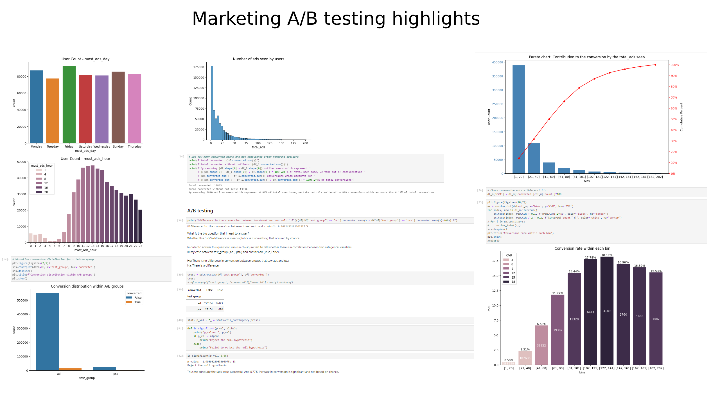

# Data Analyst portfolio projects

***

## 1. Excel interactive dashboard

In this project, I created an interactive Excel dashboard to analyze coffee sales over a four-year period, based on a tutorial by [Mo Chen](https://www.youtube.com/watch?v=m13o5aqeCbM&ab_channel=MoChen). I gathered customer and product data from separate sources and integrated them into the dashboard for comprehensive analysis. With the dashboard, you can manipulate the timeline with real-time data updates, apply different filters, view total sales by country, and identify the top 5 customers by sales.

---

## 2. ETL pipeline project (from raw data from multiple sources to one database and Power BI Dashboard)

This project stands out as one of the most technically complex that I've created. I mainly focused on solidifying my SQL skills through the implementation of a full ETL lifecycle - **extracting** raw data from different sources into staging zone tables, performing data cleaning and **transformation**, and **loading** data into a final database for further descriptive analysis in Power BI.

I utilized data about movies and their ratings from two sources:
- [Rotten Tomatoes Top Movies dataset from Kaggle](https://www.kaggle.com/datasets/thedevastator/rotten-tomatoes-top-movies-ratings-and-technical); 
- [IMDb Non-Commercial Dataset](https://developer.imdb.com/non-commercial-datasets/). 

Raw data was loaded into three staging zone tables. Within the staging zone, I conducted basic cleaning, removed duplicates, performed type casting, and most importantly defined a subset of data common to both sources. The subset was determined based on matching movie titles and release years across both datasets.

Loading data into the final database included unnesting some columns for a normalized representation (e.g. a string of genres into distinct rows per genre), further type casting (e.g. using regex to transform "$112.25M" into a numerical equivalent), and establishing many-to-many relationships between certain tables.

While transforming the data, the sample size was significantly reduced, impacting the depth of analysis possible in Power BI. Thus this part served more as a descriptive exercise and helped familiarize myself with Power BI capabilities.

---

## 3. Tableau interactive dashboard (British Airways Review)
In this project, I created an interactive dashboard in Tableau to showcase average review statistics for British Airways, based on a tutorial by [Mo Chen](https://www.youtube.com/watch?v=KlAKAarfLRQ&t=1167s&ab_channel=MoChen). I imported data from two CSV files and introduced a custom parameter metric designed to effectively measure customer satisfaction. Utilizing Tableau features I created a dashboard featuring a map and a line chart showcasing the custom metric, multiple filters, descriptive summary, and a dual bar chart displaying the average custom metric by aircraft type.

---

## 4. Marketing A/B Testing python project (EDA, Pareto, Chi-square)

In this project I aimed to solve a real world problem of Analysing the success of a marketing compaign based on a [kaggle Marketing A/B testing dataset](https://www.kaggle.com/datasets/faviovaz/marketing-ab-testing). 
Data dictionary:
- Index: Row index
- user id: User ID (unique)
- test group: If "ad" the person saw the advertisement, if "psa" they only saw the public service announcement
- converted: If a person bought the product then True, else is False
- total ads: Amount of ads seen by person
- most ads day: Day that the person saw the biggest amount of ads
- most ads hour: Hour of day that the person saw the biggest amount of ads

With prior Exploratory Data Analysis, I summarized and visualized the main dataset characteristics, tracked conversions within both groups across different attributes, and concluded that the data has some outliers. I found that there is a difference in conversion rates between groups, but further A/B testing is needed to determine its significance. I also identified the days and hours when users saw the highest number of ads.

When removing outliers, I accounted for the number of users and conversions excluded from consideration at this step.

I was interested in seeing the contribution to conversion based on the number of ads seen. To visualize this, I binned the data by the number of ads seen, calculated the conversion rate within each bin, and created a Pareto chart. At this stage, I concluded that most users haven't seen that many ads. Despite a rapid decline in the number of ads viewed, the contribution to the conversion rate remains consistently stable. Conversion among those who saw more ads is significantly higher.

For the A/B testing part, I ran a chi-square test to determine whether there is a correlation between two categorical variables. Based on the test results, I concluded that the difference of 0.77% in conversion between the two groups is significant.

---
