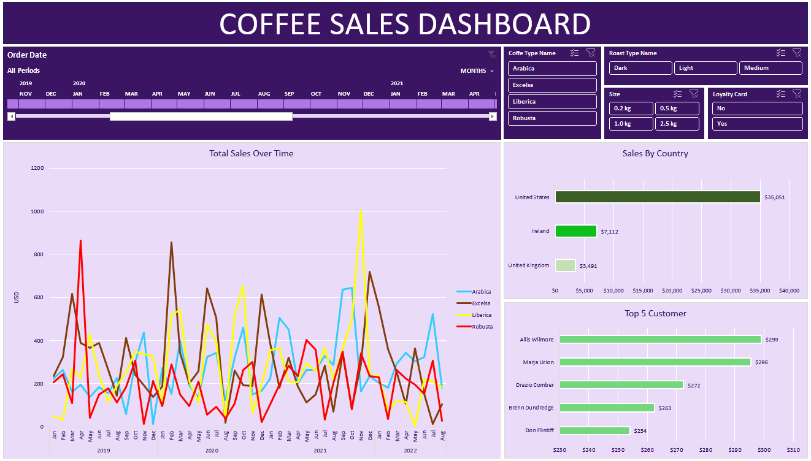
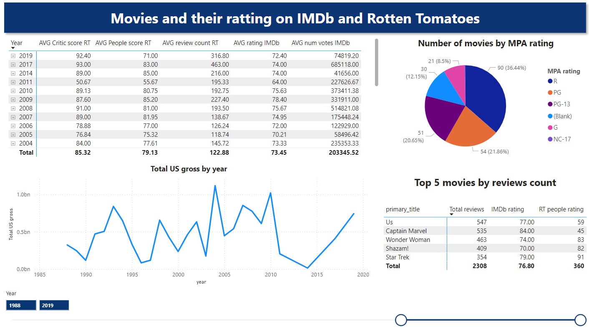
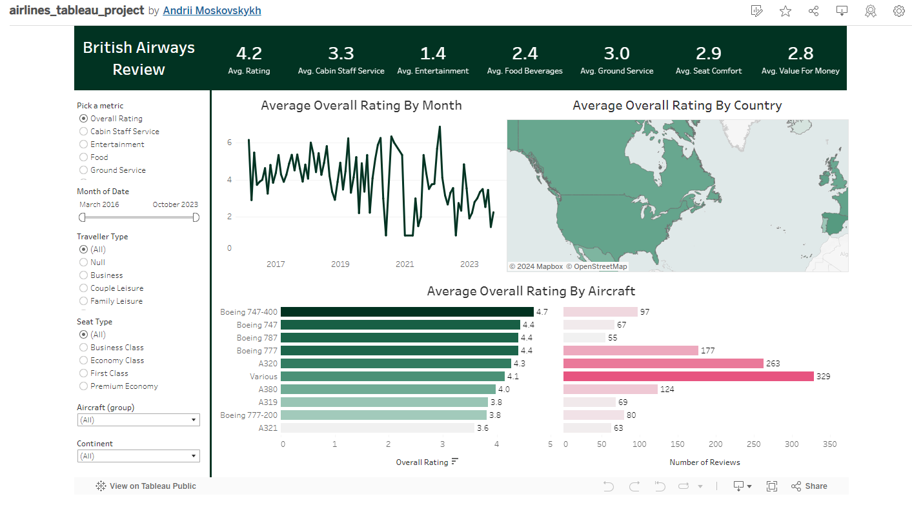

# Data Analyst portfolio projects

***

## 1. Excel interactive dashboard

In this project, I created an interactive Excel dashboard to analyze coffee sales over a four-year period, based on a tutorial by [Mo Chen](https://www.youtube.com/watch?v=m13o5aqeCbM&ab_channel=MoChen). I gathered customer and product data from separate sources and integrated them into the dashboard for comprehensive analysis. With the dashboard, you can manipulate the timeline with real-time data updates, apply different filters, view total sales by country, and identify the top 5 customers by sales.

---

## 2. ETL pipeline project (from raw data from multiple sources to one database and Power BI Dashboard)

This project stands out as one of the most technically complex that I've created. I mainly focused on solidifying my SQL skills through the implementation of a full ETL lifecycle - **extracting** raw data from different sources into staging zone tables, performing data cleaning and **transformation**, and **loading** data into a final database for further descriptive analysis in Power BI.

I utilized data about movies and their ratings from two sources:
- [Rotten Tomatoes Top Movies dataset from Kaggle](https://www.kaggle.com/datasets/thedevastator/rotten-tomatoes-top-movies-ratings-and-technical); 
- [IMDb Non-Commercial Dataset](https://developer.imdb.com/non-commercial-datasets/). 

Raw data was loaded into three staging zone tables. Within the staging zone, I conducted basic cleaning, removed duplicates, performed type casting, and most importantly defined a subset of data common to both sources. The subset was determined based on matching movie titles and release years across both datasets.

Loading data into the final database included unnesting some columns for a normalized representation (e.g. a string of genres into distinct rows per genre), further type casting (e.g. using regex to transform "$112.25M" into a numerical equivalent), and establishing many-to-many relationships between certain tables.

While transforming the data, the sample size was significantly reduced, impacting the depth of analysis possible in Power BI. Thus this part served more as a descriptive exercise and helped familiarize myself with Power BI capabilities.

---

## 3. Tableau interactive dashboard (British Airways Review)
In this project, I created an interactive dashboard in Tableau to showcase average review statistics for British Airways, based on a tutorial by [Mo Chen](https://www.youtube.com/watch?v=m13o5aqeCbM&ab_channel=MoChen). I imported data from two CSV files and introduced a custom parameter metric designed to effectively measure customer satisfaction. Utilizing Tableau features I created a dashboard featuring a map and a line chart showcasing the custom metric, multiple filters, descriptive summary, and a dual bar chart displaying the average custom metric by aircraft type.

---

## 4. Survey monkey dataset analysis (processing data from wide to long format + basic aggregations)

In this project, I followed a video by [Shashank Kalanithi](https://www.youtube.com/watch?v=pKvWD0f18Pc&ab_channel=ShashankKalanithi) on conducting analysis on raw, wide-format pivoted data. The task statement involved basic cleaning, transforming the data into a long format, and performing basic aggregations.

---