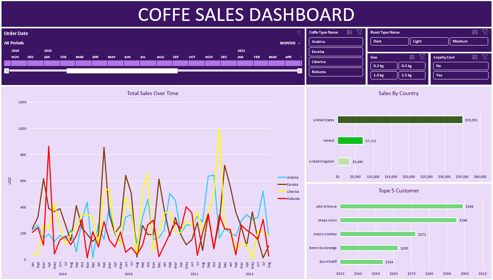

# Data Analyst portfolio projects

***

## 1. Survey monkey dataset analysis (processing data from wide to long format + basic aggregations)

In this project I followed a video by [Shashank Kalanithi](https://www.youtube.com/watch?v=pKvWD0f18Pc&ab_channel=ShashankKalanithi) on conducting analysis on raw, wide-format pivoted data. The task statement involved basic cleaning, transforming the data into a long format, and performing basic aggregations.

## 2. Excel interactive dashboard

In this project, I created an interactive Excel dashboard to analyze coffee sales over a four-year period, based on a tutorial by [Mo Chen](https://www.youtube.com/watch?v=m13o5aqeCbM&ab_channel=MoChen). I gathered customer and product data from separate sources and integrated them into the dashboard for comprehensive analysis. With the dashboard, you can manipulate the timeline with real-time data updates, apply different filters, view total sales by country, and identify the top 5 customers by sales.

