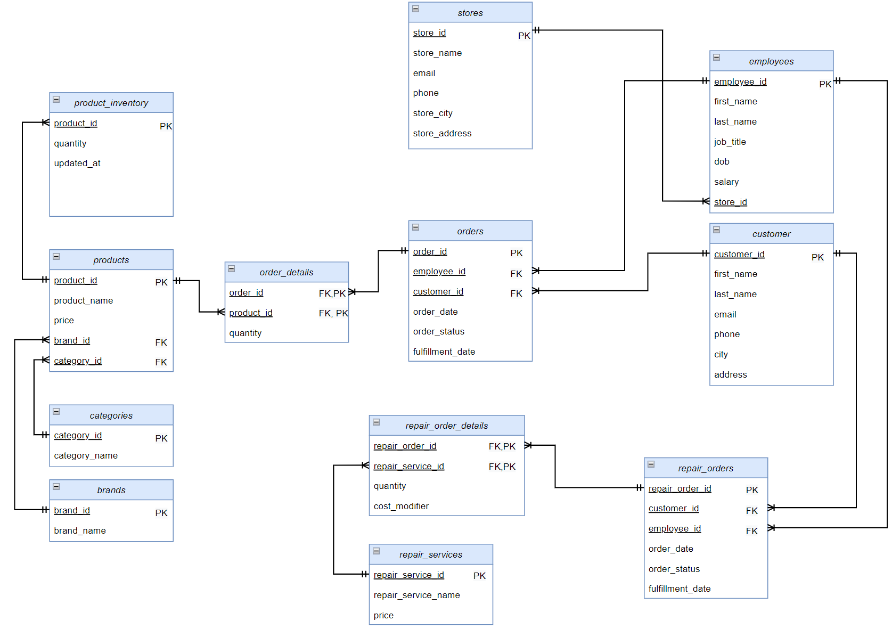

# Other Data Analytics projects

## 1. Elmir ecommerce project MS SQL Server (designing Database, generating synthetic data in SQL, formulating and answering business question in the ecommerce domain)

This project was carried out as part of my academic freelancing projects. 
The task statement was to choose an ecommerce business, conduct a brief analysis of its model, product listings and services to further design a Database in MSSQL, generate synthetic data, formulate and answer business questions with SQL queries.
Project requirement also included a well maintained documentation.

As for a model client suggested Elmir ecommerce business, which is a retailer specializing in consumer electronics and home appliances, operating both online and through physical stores. It has 3 stores located in Kharkiv and a service center. Besides selling products, the company provides services, such as computer and digital equipment repair.
Database design, generated data and business questions asked were further generalized for a typical retailer ecommerce business.
***
### General Data Model Structure for a retailer ecommerce business:
1. Products - key entity of the information system. Contains information about the physcial products presented on the store's website. Products are classified by categories, brands.
2. Repair Service Offerings – second key entity of the system, which represents computer and digital equipment repair services provided by the company.
3. Categories – characterizes groups of physical products.
4. Customers – individuals or legal entities who purchase products or services from the company.
5. Employees – individuals who work for the company. Employees are responsible for various aspects of the company's operations, including product management, logistics, customer service, and more. The entity contains basic information about employees, their positions, and salaries.
6. Stores – entity contains key information about each store, such as address, contact numbers, and email.
7. Orders – represents a request to purchase products in the store.
8. Service Orders – requests for the repair of computers or other digital equipment.
***
### Database Entitites:

| Entity Name   | Description                                                                  | Attributes                                                                                                                                                           |
|---------------|------------------------------------------------------------------------------|----------------------------------------------------------------------------------------------------------------------------------------------------------------------|
| **products**   | Contains information about physical products listed on the store's website   | `product_id` – Product identifier (PK)  
|               |                                                                              | `product_name` – Product name  
|               |                                                                              | `price` – Price  
|               |                                                                              | `category_id` – Category identifier (FK)  
|               |                                                                              | `brand_id` – Brand identifier (FK)  
| **categories**| Contains information about the category to which a product belongs           | `category_id` – Category identifier (PK)  
|               |                                                                              | `category_name` – Category name  
| **brands**    | Contains information about the brands to which products belong               | `brand_id` – Brand identifier (PK)  
|               |                                                                              | `brand_name` – Brand name  
| **employees**  | Contains basic information about employees, their positions, and salaries    | `employee_id` – Employee identifier (PK)  
|               |                                                                              | `first_name` – Employee first name  
|               |                                                                              | `last_name` – Employee last name  
|               |                                                                              | `job_title` – Job title  
|               |                                                                              | `dob` – Date of birth  
|               |                                                                              | `salary` – Salary  
|               |                                                                              | `store_id` – Store identifier (FK)  
| **customers**  | Contains information about customers                                         | `customer_id` – Customer identifier (PK)  
|               |                                                                              | `first_name` – Customer first name  
|               |                                                                              | `last_name` – Customer last name  
|               |                                                                              | `email` – Email  
|               |                                                                              | `phone` – Phone number  
|               |                                                                              | `city` – City  
|               |                                                                              | `address` – Customer address  
| **stores**    | Contains key information about each store, such as address, contact numbers, and email | `store_id` – Store identifier (PK)  
|               |                                                                              | `store_name` – Store branch name  
|               |                                                                              | `email` – Email  
|               |                                                                              | `phone` – Phone number  
|               |                                                                              | `store_city` – Store city  
|               |                                                                              | `store_address` – Store address  
| **orders**              | Contains information about orders                                       | `order_id` – Order identifier (PK)  
|                         |                                                                         | `order_date` – Order date  
|                         |                                                                         | `order_status` – Order status  
|                         |                                                                         | `fulfillment_date` – Fulfillment date  
|                         |                                                                         | `employee_id` – Employee identifier (FK)  
|                         |                                                                         | `customer_id` – Customer identifier (FK)  
| **order_details**       | Contains information about the details of an order; entity has a composite primary key | `order_id` – Order identifier (PK, FK)  
|                         |                                                                         | `product_id` – Product in store identifier (PK, FK)  
|                         |                                                                         | `quantity` – Quantity  
| **repair_orders**       | Contains information about service orders                               | `repair_order_id` – Repair order identifier (PK)  
|                         |                                                                         | `order_date` – Order date  
|                         |                                                                         | `order_status` – Order status  
|                         |                                                                         | `fulfillment_date` – Fulfillment date  
|                         |                                                                         | `employee_id` – Employee identifier (FK)  
|                         |                                                                         | `customer_id` – Customer identifier (FK)  
| **repair_services**     | Contains information about the services provided                        | `repair_service_id` – Service identifier (PK)  
|                         |                                                                         | `repair_service_name` – Service name  
|                         |                                                                         | `price` – Service price  
| **repair_order_details**| Contains information about the details of a service order; entity has a composite primary key | `repair_order_id` – Repair order identifier (PK, FK)  
|                         |                                                                         | `repair_service_id` – Repair service in store identifier (PK, FK)  
|                         |                                                                         | `quantity` – Quantity of services ordered  
|                         |                                                                         | `cost_modifier` – Cost modifier  

### Logial models:

### Physical MSSQL model:

***
### Relationships
#### Many-to-Many:
| Relationship                                   | Description                                                                             |
|------------------------------------------------|-----------------------------------------------------------------------------------------|
| **products – order_details – orders**  | One product can be listed in many orders, and one order can contain many products |
| **repair_services – repair_order_details – repair_orders** | One service can be part of many orders, and one order can contain many services |

#### One-to-Many:

| Relationship                                   | Description                                                                             |
|------------------------------------------------|-----------------------------------------------------------------------------------------|
| **categories – products**                      | One category contains many products                                                     |
| **brands – products**                          | One brand produces many products                                                        |
| **customers – orders**                         | One customer can place many orders                                                      |
| **employees – orders**                         | One employee can handle many orders                                                     |
| **stores – employees**                         | One store can have many employees                                                       |
| **customers – repair_orders**                  | One customer can place many service orders                                              |
| **employees – repair_orders**                  | One employee can handle many service orders                                             |

### Stating business tasks and answering them with queries

1. **Business Task:** Obtain information about Elmir products, including their maximum, minimum, average prices, number of products, and the number of sold units across each existing brand-category combination. Additionally, display subtotal results of aggregation for each brand and category and total (using GROUP BY ... WITH CUBE). Order by number of units sold.
     
    This business task:
    - Provides insights into the popularity of different brands and product categories – which sell better and which worse. This helps decide which products categories and brands to focus on and which might need to be discontinued;
    - Shows the level of inventory for brands and categories. This allows optimizing logistics and warehouse management;
    - Comparison of sales volumes and inventory levels is a signal for the need to stimulate demand for certain groups of products.

2. **Business Task:** Obtain information about products whose stock needs to be replenished (DATA FABRICATION). Those are products for which inventory stock quantity < number of units sold during the last month period

   This business task:
   - Shows products that need urgent restocking to avoid shortages and lost sales through categorization;
   - Serves as an indicator of demand for specific products.

3. **Business Task:** Identify top 20 products by total revenue. Include product, brand, category names, the number of units sold, product price, and total revenue.

   This business task allows:
   - Identifying the most popular products to focus on when forming the product assortment and conducting marketing campaigns;
   - Identifying which brands' and categories' products are in greatest demand among customers. This allows optimizing the assortment;
   - Analyzing pricing policies and profitability of top products.

4. **Business Task:** Obtain information about the product that generates the highest revenue within each brand's listing, including the number of units sold. Consider only fulfilled orders.

   This business task allows:
   - Identifying the most popular products of each brand;
   - Analyzing the relationship between total revenue and the number of units sold for the brand's product;
   - Planning marketing activities and promotions for top products;
   - Making informed management decisions regarding assortment policy.

5. **Business Task:** Obtain information about customers along with statistics on their orders including number of orders and products purchased, total money spent and last order date.

   This business task allows:
   - Identifying the most valuable customers and developing personalized offers for them;
   - Analyzing demand in different regions.

6. **Business Task:** Obtain information about employees along with statistics on their completed orders including number of processed orders, total revenue from processed orders, last and first order dates as well as performance review period. Performance review period must be greater than 7.

   This business task:
   - Shows the total number of orders and revenue from orders for each employee – allows assessing staff performance;
   - Top sellers of the company by revenue generated can be incentivized and motivated;
   - Helps optimize the allocation of personnel across branches.

7. **Business Task:** Obtain information about the top 10 product categories along with their sales statistics.

   This business task allows:
   - Identifying the most popular and profitable product categories;
   - Analyzing demand and adjusting the assortment;
   - Planning marketing activities and promotions for top categories;

---

## 2. Survey monkey dataset analysis (processing data from wide to long format + basic aggregations)

In this project, I followed a video by [Shashank Kalanithi](https://www.youtube.com/watch?v=pKvWD0f18Pc&ab_channel=ShashankKalanithi) on conducting analysis on raw, wide-format pivoted data. The task statement involved basic cleaning, transforming the data into a long format, and performing basic aggregations.
